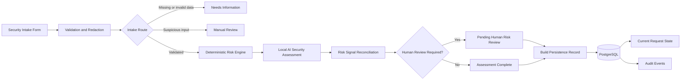

# AI-Security Review Automation

A local-first reference implementation for automating the security
intake and first-pass assessment of external SaaS and generative AI
services.

The workflow combines deterministic validation and redaction,
prompt-injection screening, local LLM-based advisory assessment,
policy-driven risk scoring, human-review routing, and
PostgreSQL-backed audit persistence.

## What This Project Demonstrates

- Structured security intake for external SaaS and generative AI use cases
- Required-field, type, enumeration, and length validation
- Secret detection and redaction before LLM processing
- Prompt-injection detection and manual-review routing
- Minimized payloads for LLM processing and database persistence
- Local inference using Ollama
- JSON Schema-constrained AI assessment output
- Deterministic and auditable risk scoring
- Reconciliation between policy rules and AI recommendations
- Human-in-the-loop review routing
- PostgreSQL persistence for current request state
- Idempotent audit-event recording
- Least-privilege database access
- No automatic approval of security requests

## Architecture



## Decision Model

The deterministic rule engine and the AI assessment are intentionally
kept separate.

The rule engine produces:

- numeric risk score
- policy risk level
- score reasons
- hard-review flags
- human-review requirement

The local LLM produces:

- assessment summary
- recommended risk level
- risk factors
- recommended controls
- reviewer questions
- human-review recommendation
- rationale

The reconciliation logic applies the following principles:

- the higher of the rule and AI risk levels becomes the triage risk level
- the AI cannot lower the deterministic policy floor
- disagreements are escalated to human review
- medium and high rule results require human review
- automatic approval is always disabled

`ASSESSMENT_COMPLETE` means automated assessment and reconciliation
have completed. It does not mean that the request has been approved.

## Security and Governance Controls

### Untrusted-input boundary

Request fields are treated as untrusted data rather than instructions.

The workflow detects prompt-injection patterns and routes suspicious
requests to manual review before any LLM processing.

### Secret handling

Potential credentials and secret-like values are detected and redacted
before the request reaches the local model.

Only the redacted and minimized `llm_payload` is sent to the model and
stored as the database request payload.

### Evidence grounding

The system prompt instructs the model to distinguish:

- facts supplied by the requester
- uncertainties requiring reviewer confirmation
- risk implications and recommended controls

The AI output remains advisory because smaller local models can still
produce interpretations that extend beyond literal evidence.

### Human oversight

The LLM does not make final approval or rejection decisions.

High-risk requests, policy hard flags, AI review recommendations, and
rule/AI disagreements are routed to a human security-review queue.

### Database security

The application uses a dedicated PostgreSQL role:

```text
ai_grc_app
```

The role has:

```text
review_requests:
  SELECT
  INSERT
  UPDATE

review_events:
  SELECT
  INSERT
  no UPDATE
  no DELETE
```

This allows the application to maintain the current request state while
preventing it from modifying or deleting existing audit events.

SQL values are supplied through query parameters rather than being
interpolated directly into the query text.

### Idempotency

Current request state is upserted by `request_id`.

Audit events use a unique `event_key`, preventing duplicate audit rows
when the same persistence step is retried.

## Technology Stack

- n8n
- PostgreSQL
- Ollama
- Qwen3 4B Instruct
- Docker Compose
- JavaScript
- SQL
- JSON Schema
- Git

The reference environment runs the LLM locally and does not require a
cloud-hosted model API.

## Repository Structure

```text
.
├── compose.yaml
├── docs
│   ├── environment-versions.md
│   └── verification
│       ├── ai-assessment.md
│       ├── compose-environment.md
│       ├── input-guardrails.md
│       ├── ollama-gpu.md
│       ├── postgresql-audit.md
│       ├── risk-reconciliation.md
│       └── security-intake.md
├── policies
│   ├── ai-assessment-schema-v1.0.0.json
│   ├── prompts
│   │   └── security-review-v1.0.0.md
│   └── risk-scoring-v1.0.0.json
├── sql
│   ├── 00-init-n8n-db.sh
│   └── 01-create-ai-grc-storage.sql
└── workflows
    ├── ollama-gpu-smoke-test.json
    └── wf-01-saas-ai-intake.json
```

## Getting Started

### Prerequisites

- Docker Desktop with Docker Compose
- Ollama
- Git
- a local Ollama-compatible model

The verified model configuration is documented in:

```text
docs/environment-versions.md
```

### Configure local environment variables

Copy the example file:

```bash
cp .env.example .env
```

Replace all placeholder values with locally generated secrets.

At minimum, configure:

```text
N8N_DB_PASSWORD
N8N_ENCRYPTION_KEY
AI_GRC_DB_PASSWORD
```

Do not commit `.env`.

### Start the local stack

```bash
docker compose up -d
docker compose ps
```

Open n8n at:

```text
http://localhost:5678
```

### Initialize AI-GRC database objects

Create the `ai_grc_app` PostgreSQL role using the password configured in
`.env`, and then apply:

```bash
docker compose exec -T postgres \
  psql \
  -v ON_ERROR_STOP=1 \
  -U postgres \
  -d postgres \
  < sql/01-create-ai-grc-storage.sql
```

### Import workflows

Import the following files into n8n:

```text
workflows/ollama-gpu-smoke-test.json
workflows/wf-01-saas-ai-intake.json
```

After import, configure local credentials for:

- Ollama
- PostgreSQL

The PostgreSQL credential should use:

```text
Host: postgres
Database: postgres
User: ai_grc_app
Port: 5432
SSL: disabled for the local Compose environment
```

The password must match `AI_GRC_DB_PASSWORD` in the local `.env` file.

## Verification Evidence

The repository includes verification records for each major control
area:

- [Local Compose environment](docs/verification/compose-environment.md)
- [Local Ollama GPU execution](docs/verification/ollama-gpu.md)
- [Security intake form](docs/verification/security-intake.md)
- [Input validation and redaction](docs/verification/input-guardrails.md)
- [Local AI security assessment](docs/verification/ai-assessment.md)
- [Deterministic risk reconciliation](docs/verification/risk-reconciliation.md)
- [PostgreSQL persistence and audit events](docs/verification/postgresql-audit.md)

Verification used synthetic test data only.

## Known Limitations

- The scoring weights are illustrative and require organization-specific calibration.
- The local 4B model can occasionally produce evidence statements that
  extend beyond literal request facts.
- Structured-output generation can occasionally require a retry.
- The current implementation is a reference architecture, not a
  production-ready approval platform.
- Database administrators retain capabilities beyond the restricted
  application role.
- Final approval and rejection workflows remain human decisions.

## Intended Use

This project is intended as a reference implementation for:

- AI governance
- security-review automation
- third-party SaaS intake
- generative AI risk triage
- human-in-the-loop control design
- auditable GRC workflow prototyping
